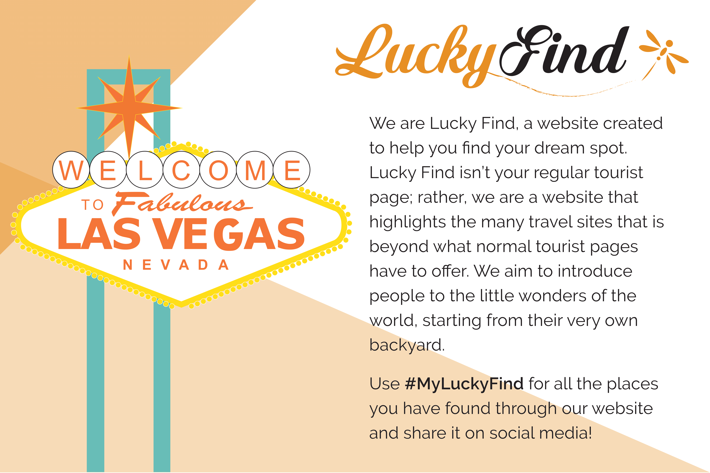

# Lucky Find
### How do we enhance a traveler's experience through our website?
> :sparkles:Lucky Find is a website created to help find the dream spot. It is based in Las Vegas, a popular tourist destination. However, Las Vegas is more than just the Strip and its endless tourist destinations.

Living in Las Vegas, many tourists usually only visit places such as the Strip, when in reality, there are many more amazing sights to see in the city. Our goal is to create an interactive website where anybody ranging from a casual visitor to an avid traveler can find new and exciting places to visit outside of the usual tourist spots.

Being exposed to new places, people and cultures, travelers will develop a wider world view. The shared experience of travel brings people together and we want to help travelers find the best attractions that locals love.

:point_right: Check out our website: [luckyfind.github.io](https://luckyfind.github.io/)

